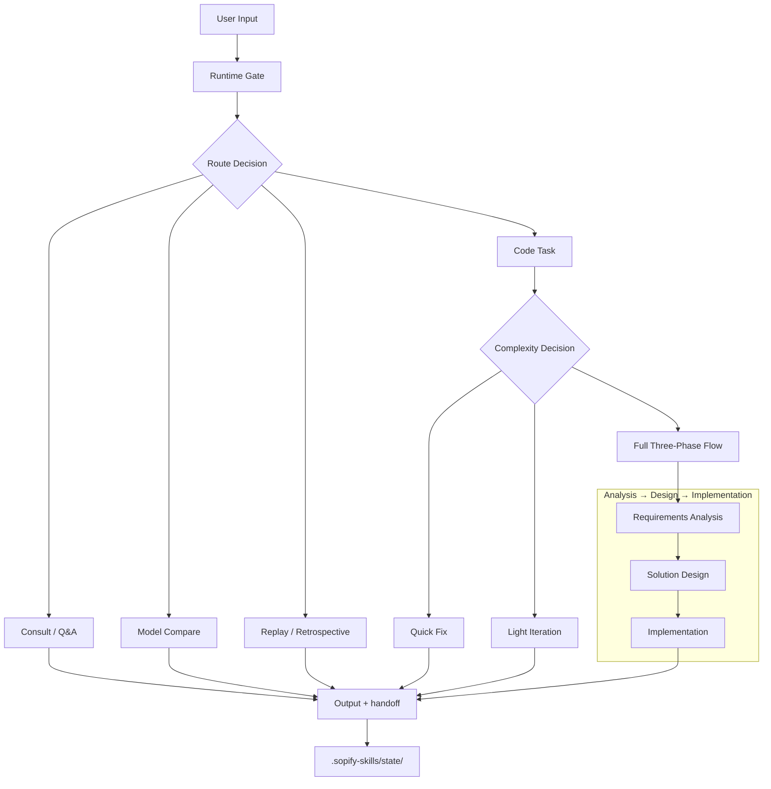
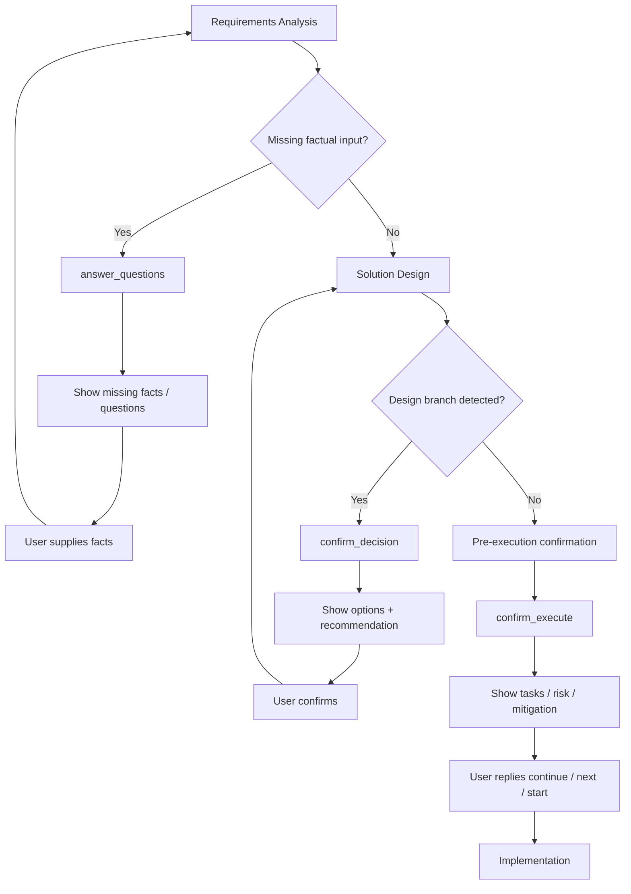
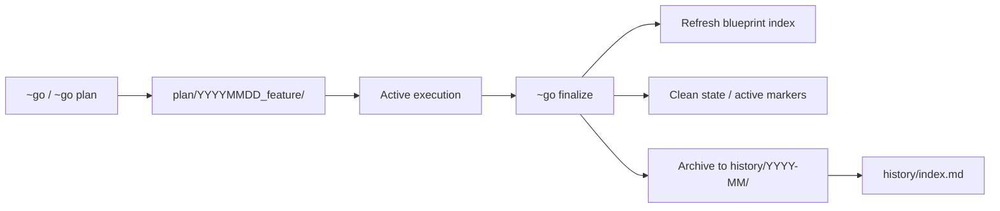

# How Sopify Works

## Design Rationale: Harness Engineering

Sopify borrows harness engineering ideas, but does not use them as the repository's homepage identity. This section explains design rationale, not product positioning.

| Harness Principle | Sopify Mapping |
|-------------------|----------------|
| Structured Knowledge | Layered knowledge in `.sopify-skills/blueprint/` and `plan/` |
| Mechanical Constraints | `manifest.json`, runtime gate, and execution gate |
| Observability | `state/current_handoff.json` and checkpoint contracts |
| Self-Healing / Continuity | clarification, decision, and develop checkpoint resume |

`Agent Cross-Review` is not a primary Sopify promise today, so it is intentionally omitted from this public workflow guide.

Official reference: [`Harness engineering: leveraging Codex in an agent-first world`](https://openai.com/index/harness-engineering/)

## Main Workflow



Workflow notes:

- Every Sopify turn enters through runtime gate first
- Only code tasks go through complexity routing
- The standard host loop follows handoff contracts instead of guessing from `Next:`

## Checkpoint Pause and Resume



Checkpoint rules:

- `answer_questions` collects missing facts before a formal plan is materialized
- `confirm_decision` resolves design branches before resuming the default runtime entry
- `confirm_execute` sits between design and implementation; it is not an internal implementation checkpoint

## Directory Structure and Layers

```text
.sopify-skills/
├── blueprint/                   # L1 long-lived blueprint (git tracked)
│   ├── README.md
│   ├── background.md
│   ├── design.md
│   └── tasks.md
├── plan/                        # L2 active plans (ignored by default)
│   ├── _registry.yaml
│   └── YYYYMMDD_feature/
├── history/                     # L3 archived plans (ignored by default)
│   ├── index.md
│   └── YYYY-MM/
├── state/                       # runtime machine truth (always ignored)
│   ├── current_handoff.json
│   ├── current_run.json
│   ├── current_decision.json
│   ├── current_clarification.json
│   └── sessions/<session_id>/...   # parallel review isolation
├── user/
│   └── preferences.md
└── project.md
```

Layer notes:

- `blueprint/` stores durable knowledge and stable contracts
- `plan/` stores active work packages, not long-lived blueprint state
- `history/` stores only closed-out plans
- `state/` is the machine-truth layer shared by runtime and hosts

## Appendix: Plan Lifecycle



This appendix is maintainer-oriented; most users only need the main workflow.
