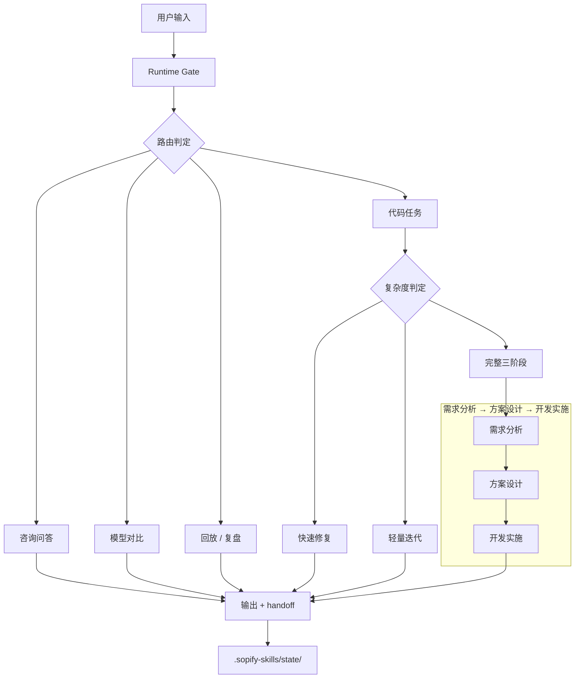
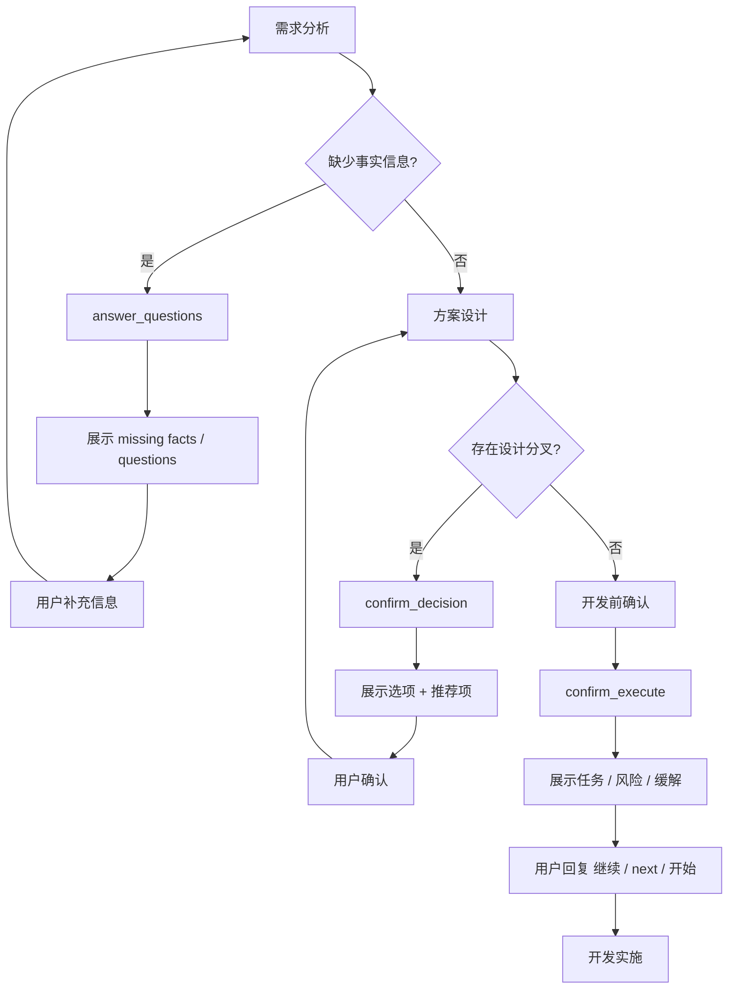
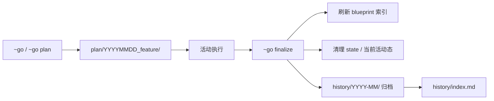

# Sopify 如何工作

## 设计来源：Harness Engineering

Sopify 借鉴 harness engineering 的设计思路，但不把它作为仓库首页定位。这里说明的是设计来源，不是产品口号。

| Harness 原则 | Sopify 落地 |
|-------------|-------------|
| Structured Knowledge | `.sopify-skills/blueprint/` + `plan/` 分层知识库 |
| Mechanical Constraints | `manifest.json` + runtime gate + execution gate |
| Observability | `state/current_handoff.json` + checkpoint contract |
| Self-Healing / Continuity | clarification / decision / develop checkpoint resume |

`Agent Cross-Review` 当前不是 Sopify 的主承诺，因此不纳入这份 public workflow 文档。

官方参考：[`Harness engineering: leveraging Codex in an agent-first world`](https://openai.com/zh-Hans-CN/index/harness-engineering/)

## 主工作流



工作流要点：

- 每次进入 Sopify 前都先经过 runtime gate
- 只有代码任务才进入复杂度分流
- 标准主链路优先依赖 handoff contract，而不是猜测 `Next:` 文案

## Checkpoint 暂停与恢复



Checkpoint 规则：

- `answer_questions` 用于补事实，不提前物化正式 plan
- `confirm_decision` 用于拍板分叉，确认后再恢复默认 runtime 入口
- `confirm_execute` 位于方案设计与开发实施之间，不属于开发阶段内部子步骤

## 目录结构与层级

```text
.sopify-skills/
├── blueprint/                   # L1 长期蓝图（git tracked）
│   ├── README.md
│   ├── background.md
│   ├── design.md
│   └── tasks.md
├── plan/                        # L2 活跃方案（默认 ignored）
│   ├── _registry.yaml
│   └── YYYYMMDD_feature/
├── history/                     # L3 已归档方案（默认 ignored）
│   ├── index.md
│   └── YYYY-MM/
├── state/                       # 运行态 machine truth（始终 ignored）
│   ├── current_handoff.json
│   ├── current_run.json
│   ├── current_decision.json
│   ├── current_clarification.json
│   └── sessions/<session_id>/...   # 并发 review 隔离
├── user/
│   └── preferences.md
└── project.md
```

层级说明：

- `blueprint/` 承载长期知识与稳定契约
- `plan/` 保存当前工作方案，不等同于长期蓝图
- `history/` 只存已收口方案
- `state/` 是宿主与 runtime 交接的机器事实层

## 附录：Plan 生命周期



附录只用于说明维护者视角的收口过程；普通用户理解主工作流即可。
